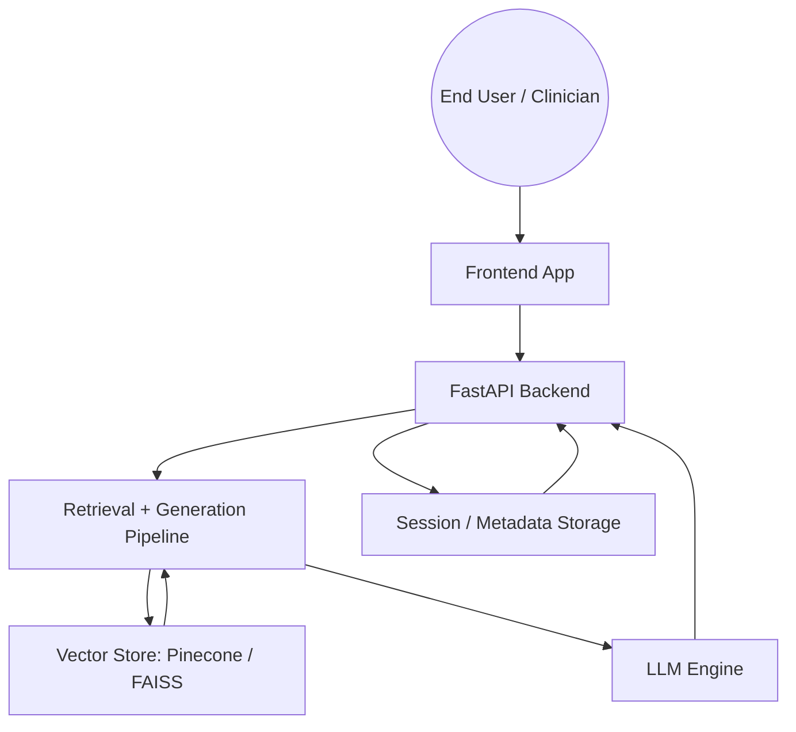
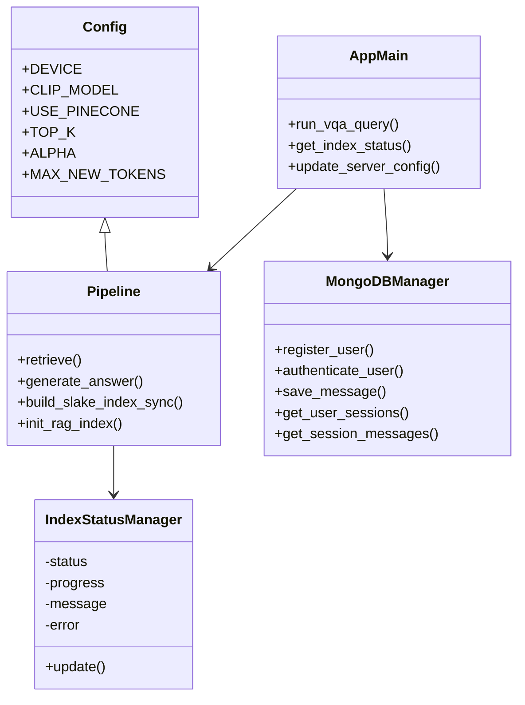
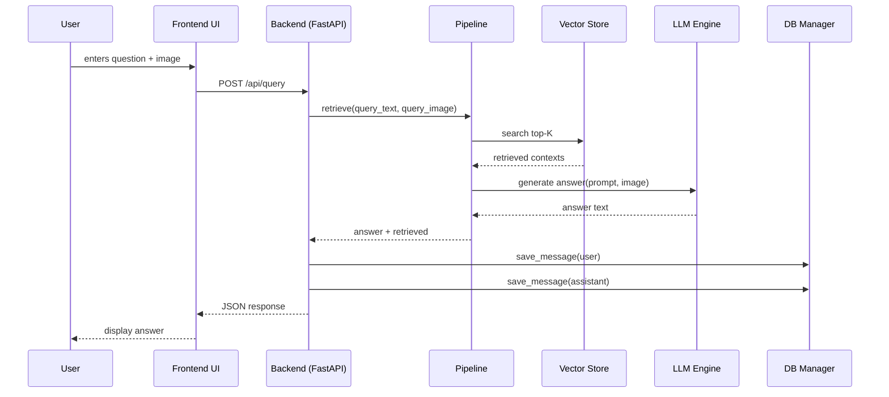

# Project Diagrams for Medical Image VQA RAG

This project is a multimodal medical Visual Question Answering (VQA) web application built with:
- `backend/` — FastAPI backend, BiomedCLIP embeddings, FAISS/Pinecone retrieval, LLM engines, session persistence
- `frontend/` — React / Vite UI for user chat, image upload, settings, and RAG context inspection
- `ml/` — separate machine learning utilities and model pipeline support

## Recommended Diagrams

The most useful diagrams for this project are:
1. Use Case Diagram
2. Activity Diagram
3. Class Diagram
4. Sequence Diagram
5. Optional: Component Diagram / Deployment Diagram

---

## 1. Use Case Diagram

### Primary actors
- **End user / Clinician**
- **System**
- **External services** (Pinecone, Hugging Face, Gemini, MongoDB Atlas)

### Key use cases
- Authenticate / register
- Start new consultation session
- Upload a medical image
- Ask a clinical question
- Receive a grounded answer
- View retrieval context / explainability
- Switch generative engine and query hyperparameters
- Rebuild or check vector index status
- Clear a session and reset cached image
- Generate / download a clinical report

### Diagram notes
- The user interacts through the `frontend` app.
- The `frontend` calls backend REST endpoints in `backend/app/main.py`.
- The backend uses `pipeline.py` for retrieval and generation.
- The backend stores session data locally under `backend/data/sessions` and optionally persists metadata/messages via `db.py`.
- External LLM backends are optional: `gemini_api`, `huggingface_api`, `local_moondream`, `local_llava`.



---

## 2. Activity Diagram

### Main query processing flow
1. User submits text question and optionally uploads an image.
2. Frontend sends `POST /api/query`.
3. Backend validates index readiness and loads session history.
4. Backend caches uploaded image in `backend/data/sessions/<session_id>/active_image.jpg`.
5. `pipeline.retrieve()` produces the top-K SLAKE contexts.
6. `pipeline.generate_answer()` builds a grounded medical prompt.
7. Generative engine produces an answer.
8. Backend stores history and message records.
9. Backend returns answer, retrieved contexts, and engine metadata.
10. Frontend renders the assistant reply and RAG context panel.

### Index initialization / rebuild flow
1. Server startup triggers `pipeline.init_rag_index()`.
2. If Pinecone is configured, backend connects to Pinecone.
3. If FAISS is configured, backend loads local index or builds it.
4. Index build downloads SLAKE dataset, extracts images, encodes embeddings, and saves the FAISS index.
5. Frontend polls `GET /api/index-status` until status is `ready`.

```mermaid
flowchart TD
  A[User submits question] --> B[Frontend POST /api/query]
  B --> C[Backend run_vqa_query()]
  C --> D[Load session history & image cache]
  C --> E[pipeline.retrieve()] 
  E --> F[BiomedCLIP encode text/image]
  F --> G[Query Pinecone / FAISS]
  G --> H[Retrieved SLAKE contexts]
  H --> I[Build grounded medical prompt]
  I --> J[Run configured LLM engine]
  J --> K[Answer generated]
  K --> L[Save history and log metadata]
  L --> M[Return JSON response]
  M --> N[Frontend displays answer]
```

---

## 3. Class Diagram

### Backend modules & data structures
- `backend/app/config.py`
  - holds static configuration values and environment loading
- `backend/app/pipeline.py`
  - `IndexStatusManager`
  - `embed_image()`, `embed_text()`, `retrieve()`, `generate_answer()`
  - engine adapters: `_generate_via_hf_api()`, `_generate_via_gemini_api()`, `_generate_via_local_moondream()`, `_generate_via_local_llava()`
- `backend/app/main.py`
  - API route handlers for `/api/query`, `/api/config`, `/api/index-status`, `/api/session/*`, `/api/rebuild-index`, `/api/auth/*`, `/api/reports/*`
- `backend/app/db.py`
  - `MongoDBManager` for local JSON fallback and optional Atlas persistence
  - session/message/report persistence methods

### Frontend components & models
- `frontend/src/App.tsx`
  - application state: `sessionId`, `messages`, `config`, `indexStatus`
- `frontend/src/types.ts`
  - `ChatMessage`
  - `RetrievedContext`
  - `Session`
  - `AppConfig`
  - `IndexStatus`
- UI components:
  - `Header`, `Sidebar`, `WelcomeView`, `ChatMessages`, `ChatInput`, `RagInspector`, `SettingsModal`, `ReportModal`

### Suggested class diagram
- `App` aggregates `ChatMessage[]`, `Session[]`, and `AppConfig`
- `FastAPI Backend` depends on `pipeline` and `MongoDBManager`
- `pipeline` depends on `config` and external models/storage



---

## 4. Sequence Diagram

### Query sequence
- Browser / User -> Frontend React UI
- Frontend -> Backend `POST /api/query`
- Backend `run_vqa_query()` -> session load/cache
- Backend -> `pipeline.retrieve()` -> BiomedCLIP encode -> Pinecone/FAISS query
- Backend -> `pipeline.generate_answer()` -> Prompt builder -> Selected LLM engine
- LLM engine -> Backend returns answer
- Backend -> save history via `db_manager`
- Backend -> Frontend returns result
- Frontend -> render answer + retrieved context

### Recommended sequence diagram block


---

## 5. Optional: Component Diagram

If you want a higher-level architecture view, include a component diagram with:
- `frontend/` React app
- `backend/` FastAPI API
- `pipeline.py` RAG engine
- `config.py` environment config
- `db.py` persistence layer
- `Pinecone / FAISS` vector store
- `Hugging Face / Gemini / local models` generative backends
- `MongoDB Atlas / Local JSON` storage layer

---

## Notes for this project
- This is primarily a **web application** with a **Retrieval-Augmented Generation** backend.
- The most valuable diagrams are the **query flow sequence**, the **RAG retrieval activity**, and the **frontend-backend-use case mapping**.
- Because the backend is mostly function-based rather than object-heavy, the class diagram should focus on modules and data models rather than many deep inheritance chains.
- The existing `backend/app/pipeline.py` and `frontend/src/types.ts` files contain the core runtime data models for the system.

## Suggested next step
Use this file as the source of truth and draw diagrams in your preferred tool:
- Mermaid / Markdown-capable editor
- Draw.io / diagrams.net
- Lucidchart / Figma
- Visual Paradigm

If you want, I can also generate a second file with Mermaid-only diagram definitions ready to paste into a Markdown renderer.