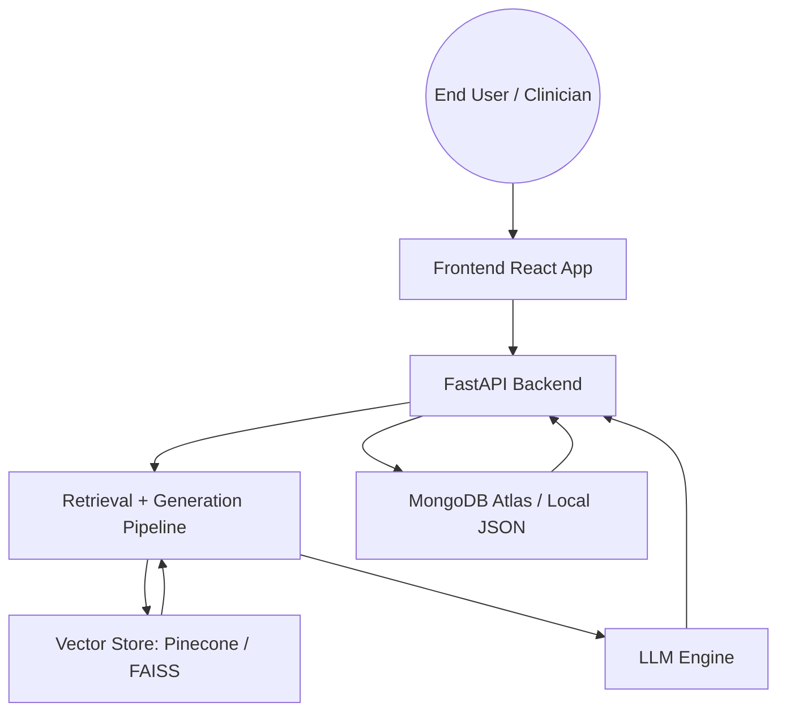
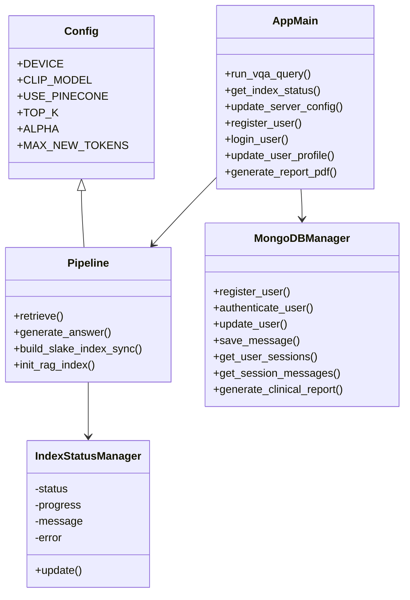
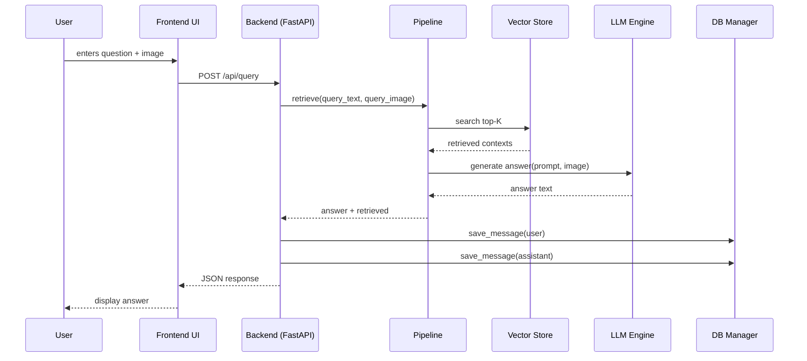
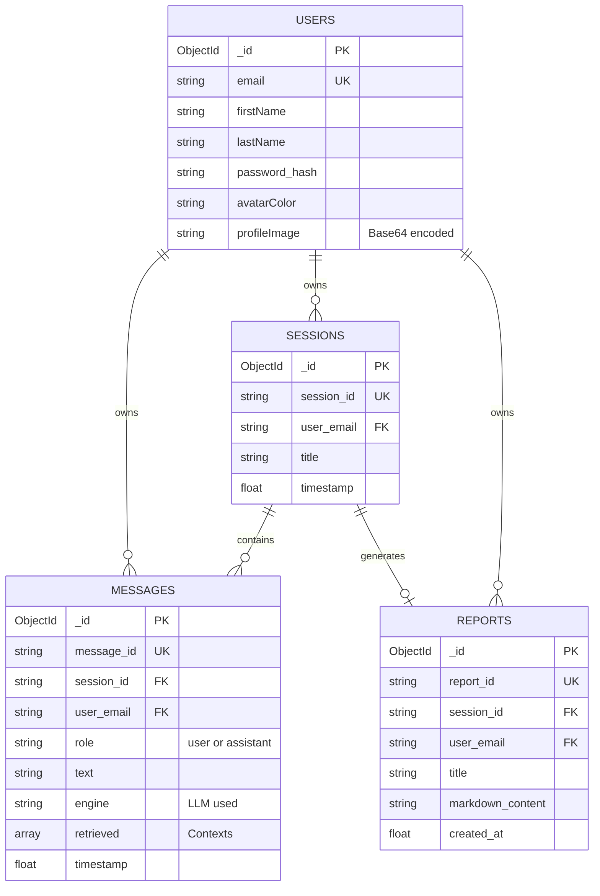
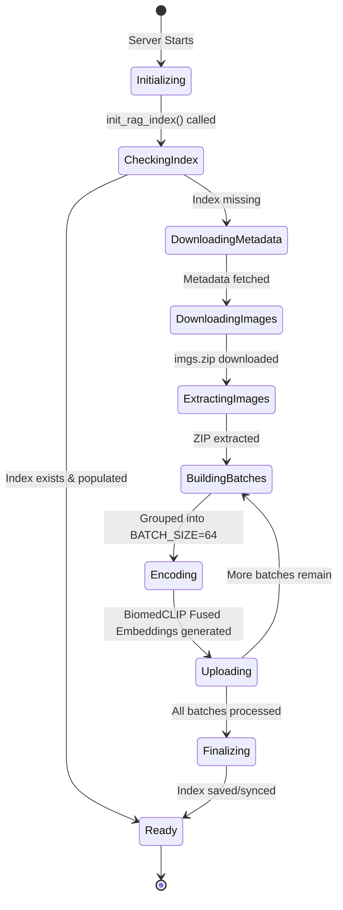

# Project Diagrams for Medical Image VQA RAG

This multimodal Medical Visual Question Answering (VQA) web application is a complete, production-ready Retrieval-Augmented Generation (RAG) system designed to assist clinicians and researchers. At its core, the system acts as a highly intelligent medical assistant capable of interpreting radiology imagery (such as X-rays, MRIs, and CT scans) in tandem with complex clinical questions. To achieve this safely and accurately, it employs a robust RAG pipeline. Instead of relying solely on the inherent, sometimes hallucination-prone knowledge of a Large Language Model, the system first encodes the user's query and uploaded medical image into a fused mathematical vector using the specialized BiomedCLIP vision-language encoder. It then queries a high-speed vector database—either a local FAISS index or a cloud-hosted Pinecone environment—to instantly retrieve the most clinically relevant, historically verified cases from the comprehensive SLAKE medical dataset.

Once the most relevant clinical contexts are retrieved, the backend constructs a highly detailed, grounded prompt. This prompt, combining the user's original image and question alongside the verified historical data, is passed to one of four configurable Generative AI engines. Users can dynamically hot-swap between cloud-based powerhouses like the Gemini API or Hugging Face Inference API, or opt for entirely local, privacy-preserving execution using models like Moondream or a quantized LLaVA-1.5 7B. This modular engine architecture guarantees that the application can scale from low-end CPU-only laptops to high-performance CUDA workstations without altering the core codebase.

The entire experience is delivered through a stunning, premium React and Vite-powered frontend interface wrapped in a clinical dark theme. The UI is rich with glassmorphism effects, micro-animations, and dynamic feedback. Users interact with a conversational chat dashboard that preserves history across multiple sessions. A dedicated "RAG Inspector" accordion allows clinicians to transparently peer into the "brain" of the AI, reviewing the exact historical SLAKE reference images and medical facts the engine used to derive its answer.

Furthermore, the platform functions as a fully authenticated SaaS-style web application. It features a robust MongoDB Atlas integration that securely manages user registration, login authentication, and persistent storage of chat histories. Users can personalize their experience through a beautifully designed Profile Settings modal, where they can update their credentials, select dynamic avatar gradient themes, or upload custom profile photographs. Finally, the application empowers clinicians to seamlessly synthesize their consultation sessions into downloadable Clinical Reports, ensuring that the insights generated by the multimodal AI can be easily archived or shared.

## Recommended Diagrams

The most useful diagrams for this project are:
1. Use Case Diagram
2. Activity Diagram
3. Class Diagram
4. Sequence Diagram
5. Optional: Component Diagram / Deployment Diagram

---

## 1. Use Case Diagram

### Primary actors
- **End user / Clinician**
- **System**
- **External services** (Pinecone, Hugging Face, Gemini, MongoDB Atlas)

### Key use cases
- Authenticate / register / login
- Manage profile settings (name, email, password, avatar/image)
- Start new consultation session
- Upload a medical image
- Ask a clinical question
- Receive a grounded answer
- View retrieval context / explainability
- Generate / download a clinical report (PDF/Markdown)
- Switch generative engine and query hyperparameters
- Rebuild or check vector index status
- Clear a session and reset cached image

### Diagram notes
- The user interacts through the `frontend` React app.
- The `frontend` calls backend REST endpoints in `backend/app/main.py`.
- The backend uses `pipeline.py` for retrieval and generation.
- The backend stores session data locally and syncs with **MongoDB Atlas** via `db.py`.
- External LLM backends are optional: `gemini_api`, `huggingface_api`, `local_moondream`, `local_llava`.



---

## 2. Activity Diagram

### Main query processing flow
1. User submits text question and optionally uploads an image.
2. Frontend sends `POST /api/query`.
3. Backend validates index readiness and loads session history from MongoDB/Local.
4. Backend caches uploaded image in `backend/data/sessions/<session_id>/active_image.jpg`.
5. `pipeline.retrieve()` produces the top-K SLAKE contexts.
6. `pipeline.generate_answer()` builds a grounded medical prompt.
7. Generative engine produces an answer.
8. Backend stores history, messages, and metadata to MongoDB via `db_manager`.
9. Backend returns answer, retrieved contexts, and engine metadata.
10. Frontend renders the assistant reply and RAG context panel.

### Index initialization / rebuild flow
1. Server startup triggers `pipeline.init_rag_index()`.
2. If Pinecone is configured, backend connects to Pinecone.
3. If FAISS is configured, backend loads local index or builds it.
4. Index build downloads SLAKE dataset, extracts images, encodes embeddings, and saves the FAISS index.
5. Frontend polls `GET /api/index-status` until status is `ready`.

```mermaid
flowchart TD
  A[User submits question] --> B[Frontend POST /api/query]
  B --> C[Backend run_vqa_query()]
  C --> D[Load session history from MongoDB]
  C --> E[pipeline.retrieve()] 
  E --> F[BiomedCLIP encode text/image]
  F --> G[Query Pinecone / FAISS]
  G --> H[Retrieved SLAKE contexts]
  H --> I[Build grounded medical prompt]
  I --> J[Run configured LLM engine]
  J --> K[Answer generated]
  K --> L[Save history to MongoDB Atlas]
  L --> M[Return JSON response]
  M --> N[Frontend displays answer]
```

---

## 3. Class Diagram

### Backend modules & data structures
- `backend/app/config.py`
  - holds static configuration values and environment loading
- `backend/app/pipeline.py`
  - `IndexStatusManager`
  - `embed_image()`, `embed_text()`, `retrieve()`, `generate_answer()`
  - engine adapters: `_generate_via_hf_api()`, `_generate_via_gemini_api()`, `_generate_via_local_moondream()`, `_generate_via_local_llava()`
- `backend/app/main.py`
  - API route handlers for `/api/query`, `/api/config`, `/api/index-status`, `/api/session/*`, `/api/rebuild-index`, `/api/auth/*`, `/api/reports/*`
- `backend/app/db.py`
  - `MongoDBManager` for local JSON fallback and optional Atlas persistence
  - session/message/report persistence methods

### Frontend components & models
- `frontend/src/App.tsx`
  - application state: `sessionId`, `messages`, `config`, `indexStatus`
- `frontend/src/types.ts`
  - `ChatMessage`
  - `RetrievedContext`
  - `Session`
  - `AppConfig`
  - `IndexStatus`
- UI components:
  - `Header`, `Sidebar`, `WelcomeView`, `ChatMessages`, `ChatInput`, `RagInspector`, `SettingsModal`, `ReportModal`

### Suggested class diagram
- `App` aggregates `ChatMessage[]`, `Session[]`, and `AppConfig`
- `FastAPI Backend` depends on `pipeline` and `MongoDBManager`
- `pipeline` depends on `config` and external models/storage



---

## 4. Sequence Diagram

### Query sequence
- Browser / User -> Frontend React UI
- Frontend -> Backend `POST /api/query`
- Backend `run_vqa_query()` -> session load/cache
- Backend -> `pipeline.retrieve()` -> BiomedCLIP encode -> Pinecone/FAISS query
- Backend -> `pipeline.generate_answer()` -> Prompt builder -> Selected LLM engine
- LLM engine -> Backend returns answer
- Backend -> save history via `db_manager`
- Backend -> Frontend returns result
- Frontend -> render answer + retrieved context

### Recommended sequence diagram block


---

## 5. Component / Deployment Diagram

This diagram illustrates how the system's logical components are separated and deployed, highlighting the cloud dependencies versus local runtime components.

```mermaid
flowchart TB
  subgraph Client Environment
    Browser[Web Browser]
  end

  subgraph Local / Server Runtime
    UI[Frontend (React / Vite)]
    API[FastAPI Server]
    Pipeline[RAG Pipeline Engine]
    FAISS[(Local FAISS Cache)]
    Models[Local LLM / CLIP Models]
  end

  subgraph Cloud Services
    MongoDB[(MongoDB Atlas)]
    Pinecone[(Pinecone Vector DB)]
    HF[Hugging Face API]
    Gemini[Google Gemini API]
  end

  Browser <-->|HTTP / API calls| API
  API --> UI
  API <-->|pymongo| MongoDB
  API <--> Pipeline
  
  Pipeline <-->|gRPC / HTTPS| Pinecone
  Pipeline <--> FAISS
  Pipeline <--> Models
  
  Pipeline <-->|REST API| HF
  Pipeline <-->|REST API| Gemini
```

---

## 6. Entity-Relationship Diagram (ERD)

This diagram maps out the collections in the MongoDB Atlas database and how they relate to one another via the `email` and `session_id` fields.



---

## 7. State Machine Diagram: Index Build Process

This state diagram maps the lifecycle of the background thread that initializes the SLAKE dataset and prepares the Pinecone or FAISS vector index.

