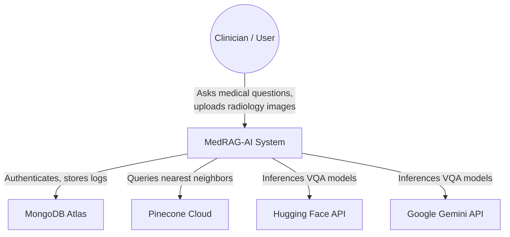
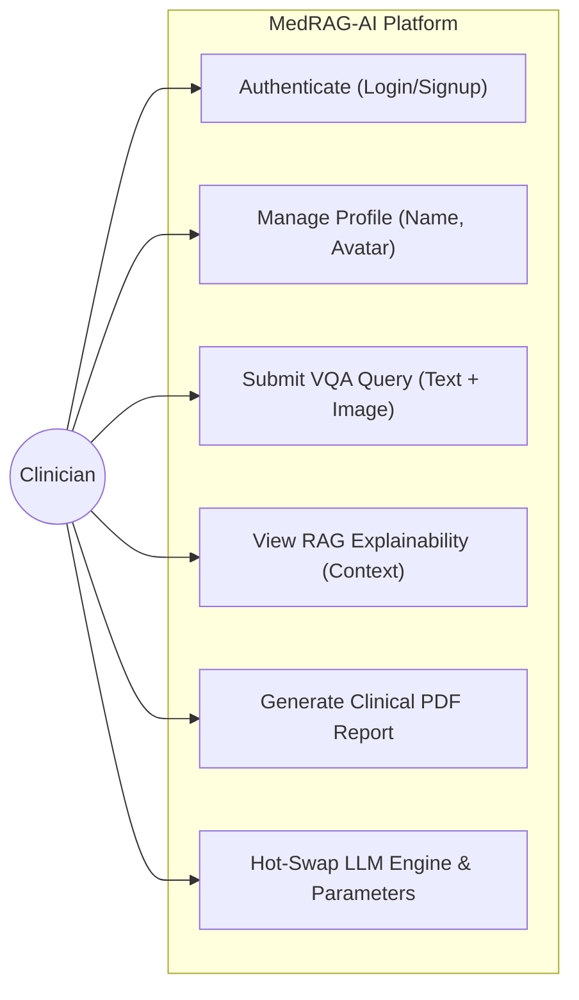
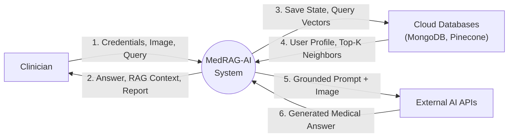
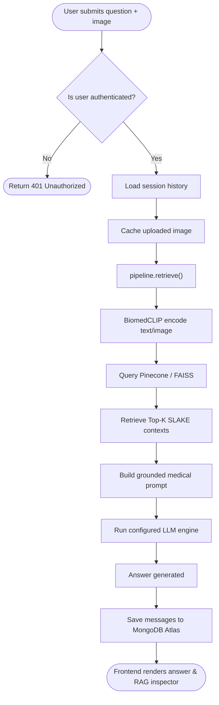
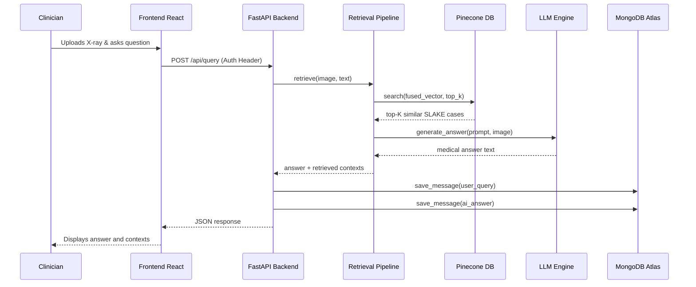
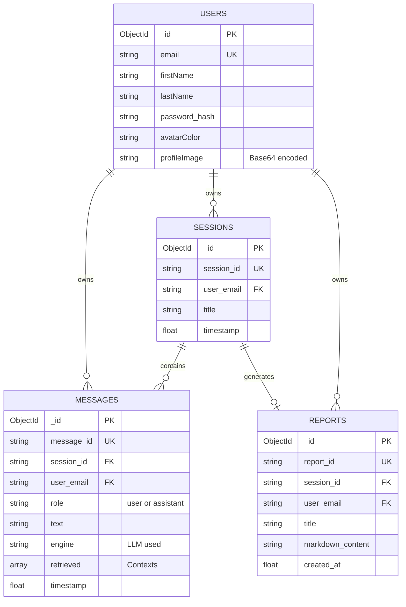
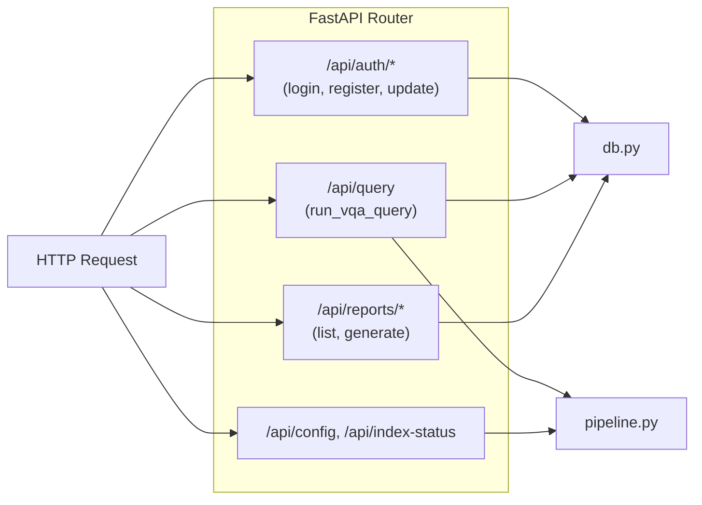
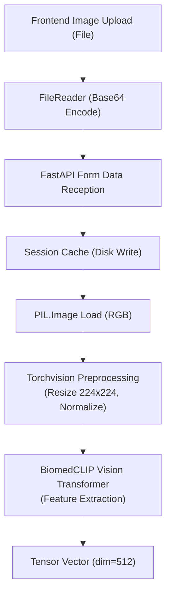
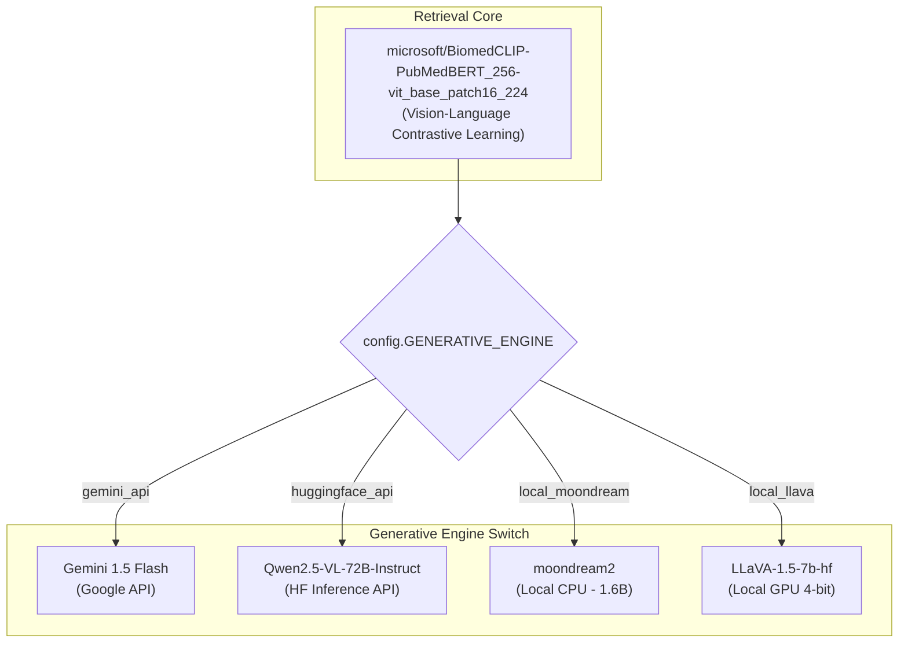

# MedRAG-AI: Comprehensive System Diagrams

This document contains all essential and recommended architectural diagrams for the **MedRAG-AI** (Medical Image VQA RAG) platform.

---

## Part 1: Essential Diagrams ⭐

### 1. System Architecture
This high-level architecture diagram illustrates the logical separation of concerns across the Presentation, Application, AI/ML, and Data layers.

```mermaid
flowchart TD
    subgraph Presentation Layer
        UI["React + Vite UI"]
        Dashboard["Chat Dashboard"]
        Profile["Profile & Settings"]
        RAGInspector["RAG Context Inspector"]
    end

    subgraph Application Layer
        API["FastAPI Backend"]
        AuthManager["Authentication Manager"]
        SessionManager["Session & Report Manager"]
        QueryRouter["Query Router"]
    end

    subgraph AI & ML Layer
        Pipeline["RAG Pipeline Engine"]
        Encoder["BiomedCLIP Encoder"]
        Generators["Multi-LLM Generators"]
    end

    subgraph Data & Storage Layer
        Mongo[("MongoDB Atlas\n(Users, Chats, Reports)")]
        VectorDB[("Pinecone / FAISS\n(SLAKE Embeddings)")]
    end

    Presentation Layer <-->|HTTP/REST| Application Layer
    Application Layer <--> Data & Storage Layer
    Application Layer <--> AI & ML Layer
    AI & ML Layer <--> VectorDB
```

---

### 2. System Context
A C4 Context diagram showing the MedRAG-AI system in its environment, interacting with users and external cloud services.



---

### 3. Use Case Diagram
Maps out the primary interactions the user has with the platform.



---

### 4. DFD Level 0 (Context Diagram)
A high-level Data Flow Diagram showing the primary data inputs and outputs of the entire system.



---

### 5. DFD Level 1
Breaks down the system into distinct sub-processes and data stores.

```mermaid
flowchart TD
    User["Clinician"]
    
    P1(("1.0\nAuth\nManagement"))
    P2(("2.0\nSession\nManagement"))
    P3(("3.0\nRAG\nRetrieval"))
    P4(("4.0\nAI\nGeneration"))
    P5(("5.0\nReport\nGeneration"))
    
    D1[("D1: MongoDB (Users)")]
    D2[("D2: MongoDB (Sessions/Chats)")]
    D3[("D3: Vector DB (SLAKE)")]
    
    User -->|Credentials| P1
    P1 <-->|Verify/Create| D1
    P1 -->|Auth Token| User
    
    User -->|Create Chat| P2
    P2 <-->|Store History| D2
    
    User -->|Question + Image| P3
    P3 -->|Vector Search| D3
    D3 -->|Historical Contexts| P3
    
    P3 -->|Context + Query| P4
    P4 -->|Prompt| ExternalLLM["External LLM"]
    ExternalLLM -->|Answer| P4
    P4 -->|Final Response| User
    P4 -->|Log Message| P2
    
    User -->|Request Export| P5
    D2 -->|Session History| P5
    P5 -->|Clinical Report (PDF/MD)| User
```

---

### 6. System Workflow (Activity Diagram)
The end-to-end activity flow for processing a single clinical query.



---

### 7. Sequence Diagram
The sequential interactions across system boundaries during a VQA request.



---

### 8. RAG Pipeline Architecture
Detailed view of the Retrieval-Augmented Generation math and flow.

```mermaid
flowchart LR
    subgraph Input
        Img["Medical Image"]
        Text["Clinical Question"]
    end
    
    subgraph Embedding Layer (BiomedCLIP)
        ViT["ViT-B/16 Image Encoder"]
        BERT["PubMedBERT Text Encoder"]
        Blend["α-Blending (Fusion)"]
        L2["L2 Normalization"]
    end
    
    subgraph Retrieval
        Index[("Vector Index\n(FAISS/Pinecone)")]
        TopK["Top-K Matching\n(Cosine Similarity)"]
    end
    
    subgraph Generation
        Prompt["Grounded Prompt Builder\n(System + Contexts + Query)"]
        VLM["Vision-Language Model"]
    end
    
    Img --> ViT
    Text --> BERT
    ViT --> Blend
    BERT --> Blend
    Blend --> L2
    L2 --> Index
    Index --> TopK
    TopK --> Prompt
    Prompt --> VLM
```

---

## Part 2: Recommended Diagrams

### 9. Component Diagram
Shows how the logical software components are structured within the codebase.

```mermaid
flowchart TB
    subgraph Frontend (React/Vite)
        App["App.tsx (State)"]
        Components["Components (Chat, Sidebar, Modals)"]
        CSS["index.css (Tailwind)"]
        App --> Components
        Components --> CSS
    end

    subgraph Backend (FastAPI)
        Main["main.py (Routes)"]
        Config["config.py (Env)"]
        DBManager["db.py (MongoDB)"]
        Pipe["pipeline.py (RAG & Models)"]
        
        Main --> Config
        Main --> DBManager
        Main --> Pipe
        Pipe --> Config
    end
    
    Frontend <-->|REST API| Backend
```

---

### 10. Deployment Diagram
Illustrates the physical nodes and networking topology.

```mermaid
flowchart TD
    node1["Client Node\n(Browser / Mobile)"]
    
    subgraph Application Server (Local / EC2)
        node2["Uvicorn ASGI Server\n(FastAPI Runtime)"]
        node3["Local Disk\n(Images, Caches)"]
    end
    
    subgraph Cloud Infrastructure
        node4[("MongoDB Atlas Node\n(Replica Set)")]
        node5[("Pinecone DB Node\n(Serverless)")]
        node6["Hugging Face / Gemini API\n(GPU Clusters)"]
    end
    
    node1 <-->|HTTPS :8000| node2
    node2 <-->|I/O| node3
    node2 <-->|TCP / TLS| node4
    node2 <-->|HTTPS / gRPC| node5
    node2 <-->|HTTPS| node6
```

---

### 11. ER/Database Schema (MongoDB)
Maps out the data collections and relationships for the persistence layer.



---

### 12. API Flow Diagram
Details the routing architecture within the FastAPI backend.



---

### 13. Medical Image Processing Pipeline
Shows the lifecycle of a medical image uploaded by the user.



---

### 14. AI/ML Model Architecture
Visualizes the multi-model architecture combining retrieval and diverse generative engines.

